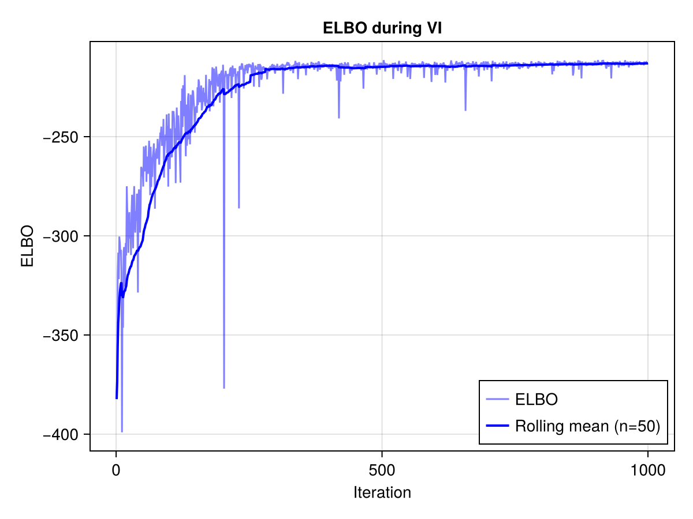
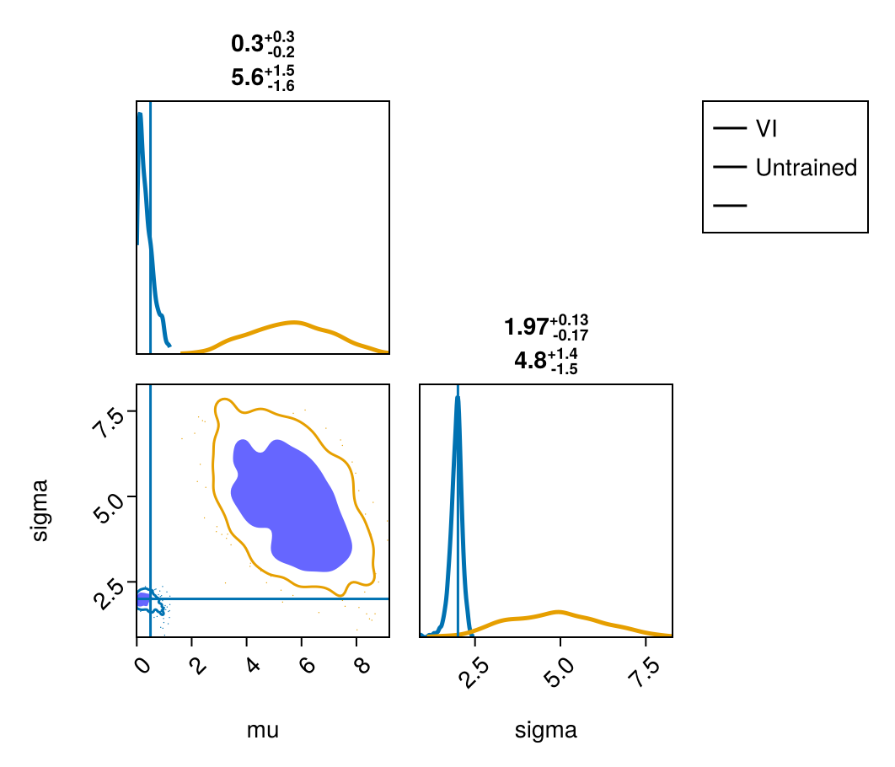

# PyTorchNormalizingFlows

[](https://github.com/arnauqb/PyTorchNormalizingFlows.jl/actions/workflows/CI.yml?query=branch%3Amain)

This package provides a Julia interface to the [Normalizing Flows](https://github.com/VincentStimper/normalizing-flows) library of PyTorch. It implements custom rules for the Zygote AD backend to allow for flow.

This allows for the normalizing flows to be used directly with [AdvancedVI.jl](https://github.com/TuringLang/AdvancedVI.jl) for variational inference.

## Installation

```julia
] add PyTorchNormalizingFlows
```

You need to have the `normflows` and `torch` Python packages installed. If `PyCall` can't find the `normflows` package, see the [PyCall](https://github.com/JuliaPy/PyCall.jl) repository for more details on how to set up the Python environment for Julia.

## Usage

```julia
using AdvancedVI
using ADTypes
using Bijectors
using DynamicPPL
using Distributions
using Optimisers
using PyTorchNormalizingFlows
using Test
using CairoMakie, PairPlots
using Zygote

@model function test_model(data)
    mu ~ Uniform(0, 10)
    sigma ~ Uniform(0, 10)
    data ~ Normal(mu, sigma)
end

## setup true data
true_mu = 0.5;
true_sigma = 2.0;
data = rand(Normal(true_mu, true_sigma), 100);
model = test_model(data);

## setup flow transform to domain of the model with bijectors
bijector_transf = inverse(bijector(model));
flow = make_masked_affine_autoregressive_flow_torch(dim=2, n_layers=4, n_units=16);
flow_transformed = transformed(flow, bijector_transf);
flow_untrained = deepcopy(flow_transformed);

## run VI
n_montecarlo = 5;
lp = DynamicPPL.LogDensityFunction(model);
elbo = AdvancedVI.RepGradELBO(n_montecarlo, entropy=AdvancedVI.MonteCarloEntropy());
optimizer = Optimisers.AdamW(5e-4);
q, _, stats, _ = AdvancedVI.optimize(
    lp,
    elbo,
    flow_transformed,
    1000;
    adtype=ADTypes.AutoZygote(),
    optimizer=optimizer,
);

##
elbo_values = [s.elbo for s in stats]
window_size = 50
rolling_mean = [mean(elbo_values[max(1,i-window_size+1):i]) for i in 1:length(elbo_values)]

f = Figure()
ax = Axis(f[1, 1], xlabel="Iteration", ylabel="ELBO", title="ELBO during VI")
lines!(ax, elbo_values, label="ELBO", alpha=0.5, color=:blue)
lines!(ax, rolling_mean, label="Rolling mean (n=$window_size)", linewidth=2, color=:blue)
axislegend(ax, position=:rb)
f

##
samples = rand(q, 1000)
samples_untrained = rand(flow_untrained, 1000)
table = (; mu=samples[1, :], sigma=samples[2, :])
table_untrained = (; mu=samples_untrained[1, :], sigma=samples_untrained[2, :])
pairplot(
    PairPlots.Series(table, label="VI"),
    PairPlots.Series(table_untrained, label="Untrained"),
    PairPlots.Truth((; mu=true_mu, sigma=true_sigma)),
)
```




# TODO

- Add more flow examples.
- GPU support.
- Enzyme support.
